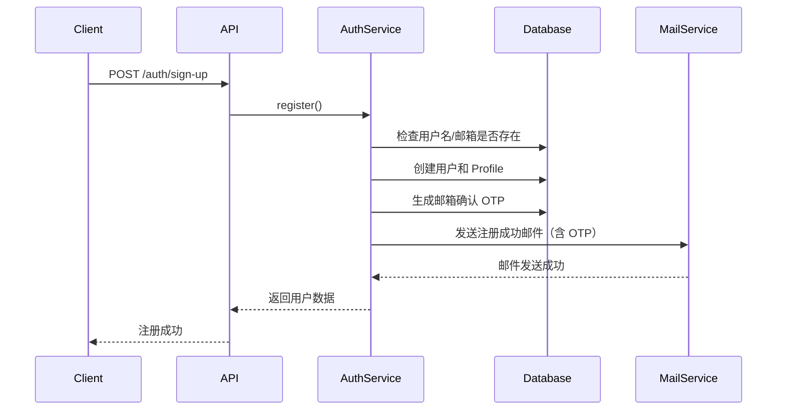
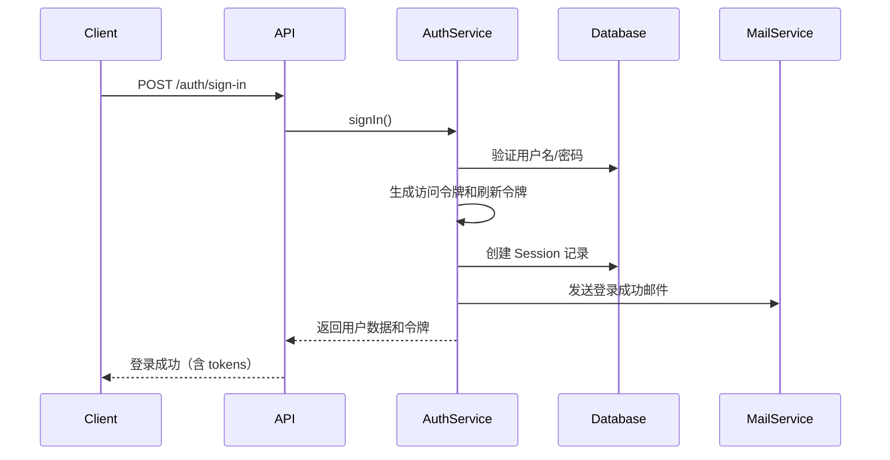

# 身份认证与权限管理机制文档

本文档详细阐述 `iam-api` 应用中的身份认证（Authentication）和权限管理（Authorization）机制。

## 目录

1. [概述](#概述)
2. [身份认证机制](#身份认证机制)
3. [权限管理机制](#权限管理机制)
4. [核心组件](#核心组件)
5. [安全特性](#安全特性)
6. [使用示例](#使用示例)
7. [配置说明](#配置说明)

---

## 概述

`iam-api` 应用采用以下安全机制：

- **身份认证**：基于 JWT（JSON Web Token）的双令牌机制
- **权限管理**：基于角色的访问控制（RBAC）
- **会话管理**：多设备会话追踪和管理
- **安全特性**：密码加密、邮箱验证、OTP 验证码等

---

## 身份认证机制

### JWT 双令牌架构

系统采用 **访问令牌（Access Token）** 和 **刷新令牌（Refresh Token）** 的双令牌机制，以提高安全性和用户体验。

#### 令牌类型

1. **访问令牌（Access Token）**
   - 用途：用于访问受保护的 API 资源
   - 有效期：较短（默认 15 分钟，可配置）
   - 存储位置：客户端内存或安全存储
   - 包含信息：用户 ID、用户名、邮箱

2. **刷新令牌（Refresh Token）**
   - 用途：用于刷新访问令牌
   - 有效期：较长（默认 7 天，可配置）
   - 存储位置：数据库（Session 表）
   - 安全特性：与数据库会话记录关联验证

#### 令牌生成流程

```typescript
// 令牌生成（AuthService.generateTokens）
const [access_token, refresh_token] = await Promise.all([
  jwtService.signAsync(
    { username: user.username, email: user.email, id: user.id },
    { secret: ACCESS_TOKEN_SECRET, expiresIn: '15m' },
  ),
  jwtService.signAsync(
    { username: user.username, email: user.email, id: user.id },
    { secret: REFRESH_TOKEN_SECRET, expiresIn: '7d' },
  ),
]);
```

### 认证流程

#### 1. 用户注册



**关键步骤**：

- 验证用户名和邮箱唯一性
- 密码使用 bcrypt 加密存储
- 自动生成邮箱确认 OTP
- 发送注册成功邮件

#### 2. 用户登录



**返回数据**：

```typescript
{
  data: User,              // 用户数据（不含密码）
  tokens: {
    access_token: string,  // 访问令牌
    refresh_token: string, // 刷新令牌
    session_token: string, // 会话 ID
    session_refresh_time: string // 令牌刷新时间戳
  }
}
```

#### 3. 令牌刷新

当访问令牌过期时，客户端使用刷新令牌获取新的令牌对：

```typescript
// POST /auth/refresh-token
// 使用 JwtRefreshGuard 保护
{
  user_id: string,
  session_token: string  // 会话 ID
}
```

**刷新流程**：

1. 验证刷新令牌签名和有效期
2. 验证数据库中是否存在对应的 Session 记录
3. 生成新的访问令牌和刷新令牌
4. 更新 Session 中的刷新令牌
5. 返回新的令牌对

### 认证守卫（Guards）

#### JwtAuthGuard（访问令牌守卫）

全局守卫，用于保护需要认证的路由。

**工作流程**：

1. 检查路由是否标记为 `@Public()`
2. 从 `Authorization` 头提取 Bearer 令牌
3. 验证令牌签名和有效期
4. 将解码后的用户信息附加到 `request.user`

**关键代码**：

```typescript:52:78:apps/iam-api/src/common/guards/jwt-auth.guard.ts
  async canActivate(context: ExecutionContext): Promise<boolean> {
    const isPublic = this.reflector.getAllAndOverride<boolean>(IS_PUBLIC_KEY, [
      context.getHandler(),
      context.getClass(),
    ]);
    if (isPublic) {
      return true;
    }
    const request = context.switchToHttp().getRequest();
    const token = this.extractTokenFromHeader(request);
    if (!token) {
      throw new GeneralUnauthorizedException(
        '缺少访问令牌，请先登录',
        'MISSING_ACCESS_TOKEN',
      );
    }
    try {
      request.user = await this.jwtService.verifyAsync(token, {
        secret: this.config.ACCESS_TOKEN_SECRET,
      });
    } catch {
      throw new GeneralUnauthorizedException(
        '访问令牌无效或已过期',
        'INVALID_ACCESS_TOKEN',
      );
    }
    return true;
  }
```

#### JwtRefreshGuard（刷新令牌守卫）

用于保护令牌刷新端点。

**工作流程**：

1. 从 `Authorization` 头提取刷新令牌
2. 验证刷新令牌签名和有效期
3. 查询数据库验证会话是否存在
4. 将用户信息附加到 `request.user`

**关键代码**：

```typescript:56:84:apps/iam-api/src/common/guards/jwt-refresh.guard.ts
  async canActivate(context: ExecutionContext): Promise<boolean> {
    const request = context.switchToHttp().getRequest();
    const token = this.extractTokenFromHeader(request);
    if (!token) {
      throw new GeneralUnauthorizedException(
        '缺少刷新令牌，请先登录',
        'MISSING_REFRESH_TOKEN',
      );
    }
    try {
      request.user = await this.jwtService.verifyAsync(token, {
        secret: this.config.REFRESH_TOKEN_SECRET,
      });
    } catch (_error) {
      throw new GeneralUnauthorizedException(
        '刷新令牌无效或已过期',
        'INVALID_REFRESH_TOKEN',
      );
    }
    const session = await this.sessionRepository.findOne({
      refresh_token: token,
      user: request.user.id,
    });
    if (!session)
      throw new GeneralUnauthorizedException(
        '刷新令牌对应的会话不存在',
        'SESSION_NOT_FOUND',
      );
    return true;
  }
```

### 会话管理

系统使用 **Session** 实体管理用户的多设备登录会话。

#### Session 实体结构

```typescript:24:97:apps/iam-api/src/features/auth/entities/session.entity.ts
@Entity()
export class Session extends Base {
  @Property({ type: 'varchar', nullable: true, default: 'unknown' })
  ip: string = 'unknown';

  @Property({ type: 'varchar', nullable: true, default: 'unknown' })
  location: string = 'unknown';

  @Property({ type: 'varchar', nullable: true, default: 'unknown' })
  device_os: string = 'unknown';

  @Property({ type: 'varchar', nullable: true, default: 'unknown' })
  device_name: string = 'unknown';

  @Property({ type: 'varchar', nullable: true, default: 'unknown' })
  device_type: string = 'unknown';

  @Property({ type: 'varchar', nullable: true, default: 'unknown' })
  browser: string = 'unknown';

  @Property({ type: 'varchar', nullable: true, default: 'unknown' })
  userAgent: string = 'unknown';

  @Property({ type: 'text' })
  refresh_token!: string;

  @ManyToOne(() => User)
  user!: Rel<User>;
}
```

#### 会话管理功能

1. **登录时创建会话**：每次登录都会创建新的 Session 记录
2. **登出单个设备**：删除指定会话记录，使该设备的刷新令牌失效
3. **登出所有设备**：删除用户的所有会话记录
4. **查询用户会话**：获取用户在所有设备上的活动会话列表

### 密码管理

#### 密码加密

- 使用 **bcrypt** 算法加密密码
- 密码字段在实体中标记为 `hidden: true`，序列化时自动排除

#### 密码相关功能

1. **注册**：自动加密并存储密码
2. **登录**：验证密码（bcrypt compare）
3. **修改密码**：需要提供当前密码验证
4. **重置密码**：通过 OTP 验证码重置（忘记密码场景）

### 邮箱验证

#### 验证流程

1. **注册时生成 OTP**：创建邮箱确认 OTP，24 小时有效期
2. **发送确认邮件**：包含 OTP 验证码
3. **用户确认邮箱**：使用 OTP 验证码确认邮箱
4. **标记为已验证**：设置 `isEmailVerified = true` 和 `emailVerifiedAt`

#### OTP 管理

- OTP 存储在独立的 **Otp** 实体中
- 支持两种类型：`EMAIL_CONFIRMATION` 和 `PASSWORD_RESET`
- 验证后自动删除 OTP 记录

---

## 权限管理机制

### 基于角色的访问控制（RBAC）

系统采用基于角色的访问控制模型，通过用户角色限制对资源的访问。

### 角色定义

当前系统支持以下角色：

```typescript:1:7:apps/iam-api/src/common/constants/role.ts
/**
 * 表示有效用户角色的类型。
 *
 * @type {'ADMIN' | 'USER'} Role
 * @description 仅接受 'ADMIN' 或 'USER' 作为有效的角色值。
 */
export type Role = 'ADMIN' | 'USER';
```

**角色说明**：

- `ADMIN`：管理员角色，具有更高权限
- `USER`：普通用户角色，基础权限

**注意**：代码中支持 `SUPERADMIN` 角色的特殊处理（自动授予所有权限），但类型定义中未包含此角色。

### 角色守卫（RolesGuard）

全局守卫，用于执行基于角色的访问控制。

**工作流程**：

1. 从路由元数据读取 `@Roles()` 装饰器指定的角色要求
2. 如果路由未指定角色要求，允许所有已认证用户访问
3. 如果用户是 `SUPERADMIN`，自动授予访问权限
4. 检查用户角色是否匹配所需角色之一

**关键代码**：

```typescript:38:50:apps/iam-api/src/common/guards/roles.guard.ts
  canActivate(context: ExecutionContext): boolean {
    const requiredRoles = this.reflector.getAllAndOverride<Role[]>(ROLES_KEY, [
      context.getHandler(),
      context.getClass(),
    ]);
    if (!requiredRoles) return true;

    const { user } = context.switchToHttp().getRequest();

    if (user.role === 'SUPERADMIN') return true;

    return requiredRoles.some((role) => user.role === role);
  }
```

### 权限装饰器

#### @Roles() 装饰器

用于指定路由或控制器所需的角色。

**使用示例**：

```typescript
@Roles('ADMIN')
@Get('admin-only')
adminOnly() { }

@Roles('ADMIN', 'USER')
@Get('common')
common() { }
```

**定义**：

```typescript:33:34:apps/iam-api/src/common/decorators/roles.decorator.ts
export const Roles = (...roles: Role[]): MethodDecorator & ClassDecorator =>
  SetMetadata(ROLES_KEY, roles);
```

#### @Public() 装饰器

用于标记公共路由，绕过认证检查。

**使用示例**：

```typescript
@Public()
@Post('login')
login() { }
```

**定义**：

```typescript:32:33:apps/iam-api/src/common/decorators/public.decorator.ts
export const Public = (): MethodDecorator & ClassDecorator =>
  SetMetadata(IS_PUBLIC_KEY, true);
```

#### @User() 装饰器

用于从请求中提取已认证的用户信息。

**使用示例**：

```typescript
@Get('profile')
getProfile(@User() user: { id: string; username: string; email: string }) {
  return user;
}
```

**定义**：

```typescript:21:26:apps/iam-api/src/common/decorators/user.decorator.ts
export const User = createParamDecorator(
  (_: unknown, ctx: ExecutionContext): unknown => {
    const request = ctx.switchToHttp().getRequest();
    return request.user;
  },
);
```

### 守卫执行顺序

系统使用以下全局守卫（按顺序执行）：

1. **JwtAuthGuard**：验证访问令牌
2. **RolesGuard**：检查角色权限
3. **ThrottlerGuard**：限流保护

在 `AppModule` 中注册：

```typescript:39:51:apps/iam-api/src/app.module.ts
  providers: [
    {
      provide: APP_GUARD,
      useClass: JwtAuthGuard,
    },
    {
      provide: APP_GUARD,
      useClass: RolesGuard,
    },
    {
      provide: APP_GUARD,
      useClass: ThrottlerGuard,
    },
```

---

## 核心组件

### 认证服务（AuthService）

提供完整的认证功能，包括：

- 用户注册和验证
- 用户登录和登出
- JWT 令牌生成和管理
- 会话管理
- 密码重置和修改
- 邮箱确认
- OTP 验证码管理
- 用户账户删除

**核心方法**：

- `register()`：用户注册
- `signIn()`：用户登录
- `signOut()`：单设备登出
- `signOutAllDevices()`：所有设备登出
- `refreshToken()`：刷新令牌
- `validateUser()`：验证用户凭据
- `generateTokens()`：生成 JWT 令牌对
- `confirmEmail()`：确认邮箱
- `forgotPassword()`：发送密码重置邮件
- `resetPassword()`：重置密码
- `changePassword()`：修改密码

### 认证控制器（AuthController）

提供认证相关的 HTTP 端点：

- `POST /auth/sign-up`：用户注册（公共）
- `POST /auth/sign-in`：用户登录（公共）
- `POST /auth/sign-out`：登出当前设备
- `POST /auth/sign-out-allDevices`：登出所有设备
- `GET /auth/sessions/:userId`：获取用户会话列表
- `GET /auth/session/:id`：获取会话详情
- `PATCH /auth/confirm-email`：确认邮箱（公共）
- `POST /auth/resend-confirmation-email`：重发确认邮件（公共）
- `PATCH /auth/forgot-password`：发送密码重置邮件（公共）
- `PATCH /auth/reset-password`：重置密码（公共）
- `PATCH /auth/change-password`：修改密码
- `PATCH /auth/refresh-token`：刷新令牌（使用 JwtRefreshGuard）
- `DELETE /auth/delete-account`：删除账户

---

## 安全特性

### 1. 密码安全

- 使用 **bcrypt** 算法加密密码
- 密码字段在序列化时自动隐藏
- 密码验证失败时统一错误消息（防止用户枚举）

### 2. 令牌安全

- 访问令牌和刷新令牌使用不同的密钥
- 刷新令牌存储在数据库中，与会话关联
- 令牌刷新时验证数据库中的会话记录
- 支持令牌过期时间配置

### 3. 会话安全

- 每个登录会话独立管理
- 支持单设备和多设备登出
- 记录设备信息（IP、位置、设备类型等）
- 刷新令牌与会话记录关联验证

### 4. 邮箱验证

- 注册时生成 OTP 验证码
- OTP 24 小时有效期
- 验证后自动删除 OTP 记录

### 5. 限流保护

- 全局限流守卫（ThrottlerGuard）
- 防止暴力破解和 DDoS 攻击

### 6. CORS 配置

- 支持跨域资源共享配置
- 限制允许的来源域名

---

## 使用示例

### 1. 公共路由（无需认证）

```typescript
@Public()
@Post('login')
async login() {
  // 此路由不需要认证
}
```

### 2. 需要认证的路由

```typescript
@Get('profile')
async getProfile(@User() user) {
  // JwtAuthGuard 会自动验证令牌
  // 用户信息通过 @User() 装饰器获取
  return user;
}
```

### 3. 基于角色的访问控制

```typescript
@Roles('ADMIN')
@Delete('users/:id')
async deleteUser(@Param('id') id: string) {
  // 只有 ADMIN 角色可以访问
}

@Roles('ADMIN', 'USER')
@Get('dashboard')
async getDashboard() {
  // ADMIN 和 USER 都可以访问
}
```

### 4. 令牌刷新

```typescript
// 客户端请求
POST /auth/refresh-token
Authorization: Bearer <refresh_token>
Body: {
  user_id: "user-id",
  session_token: "session-id"
}

// 响应
{
  message: "Refresh token generated successfully",
  access_token: "new-access-token",
  refresh_token: "new-refresh-token",
  session_token: "session-id",
  access_token_refresh_time: "timestamp"
}
```

### 5. 客户端认证流程

```typescript
// 1. 登录
const loginResponse = await fetch('/auth/sign-in', {
  method: 'POST',
  headers: { 'Content-Type': 'application/json' },
  body: JSON.stringify({
    identifier: 'user@example.com',
    password: 'password',
  }),
});
const { tokens, data } = await loginResponse.json();

// 存储令牌
localStorage.setItem('access_token', tokens.access_token);
localStorage.setItem('refresh_token', tokens.refresh_token);
localStorage.setItem('session_token', tokens.session_token);

// 2. 访问受保护资源
const protectedResponse = await fetch('/api/protected', {
  headers: {
    Authorization: `Bearer ${localStorage.getItem('access_token')}`,
  },
});

// 3. 令牌过期时刷新
if (protectedResponse.status === 401) {
  const refreshResponse = await fetch('/auth/refresh-token', {
    method: 'PATCH',
    headers: {
      Authorization: `Bearer ${localStorage.getItem('refresh_token')}`,
      'Content-Type': 'application/json',
    },
    body: JSON.stringify({
      user_id: data.id,
      session_token: localStorage.getItem('session_token'),
    }),
  });
  const { access_token, refresh_token } = await refreshResponse.json();
  // 更新存储的令牌
  localStorage.setItem('access_token', access_token);
  localStorage.setItem('refresh_token', refresh_token);
}
```

---

## 配置说明

### 环境变量

关键的安全相关环境变量：

```env
# JWT 配置
ACCESS_TOKEN_SECRET=your-access-token-secret-min-10-chars
ACCESS_TOKEN_EXPIRATION=15m
REFRESH_TOKEN_SECRET=your-refresh-token-secret-min-10-chars
REFRESH_TOKEN_EXPIRATION=7d

# CORS 配置
# 允许的 CORS 来源 URL，多个 URL 用逗号分隔
# 前端开发服务器默认端口通常是 5173（Vite）或 3000
ALLOW_CORS_URL=http://localhost:5173,http://localhost:3000
```

### 配置建议

1. **令牌密钥**：
   - 使用强随机字符串（至少 32 字符）
   - 生产环境使用环境变量管理
   - 访问令牌和刷新令牌使用不同的密钥

2. **令牌过期时间**：
   - 访问令牌：15 分钟 - 1 小时（推荐）
   - 刷新令牌：7 天 - 30 天（推荐）

3. **密码策略**：
   - 建议在客户端或 DTO 层添加密码强度验证
   - 最小长度 8 字符
   - 包含大小写字母、数字和特殊字符

4. **会话管理**：
   - 定期清理过期会话
   - 监控异常登录活动
   - 支持设备白名单/黑名单

---

## 总结

`iam-api` 应用实现了完整的身份认证和权限管理体系：

- ✅ JWT 双令牌机制（访问令牌 + 刷新令牌）
- ✅ 基于角色的访问控制（RBAC）
- ✅ 多设备会话管理
- ✅ 密码加密和验证
- ✅ 邮箱验证机制
- ✅ OTP 验证码支持
- ✅ 全局守卫保护
- ✅ 安全特性完善

系统设计遵循安全最佳实践，提供了灵活的权限控制机制，适用于多租户 SaaS 平台场景。
